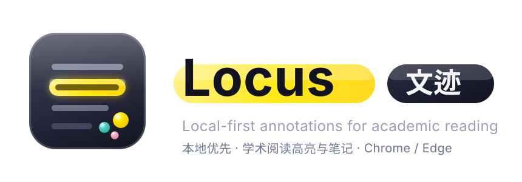
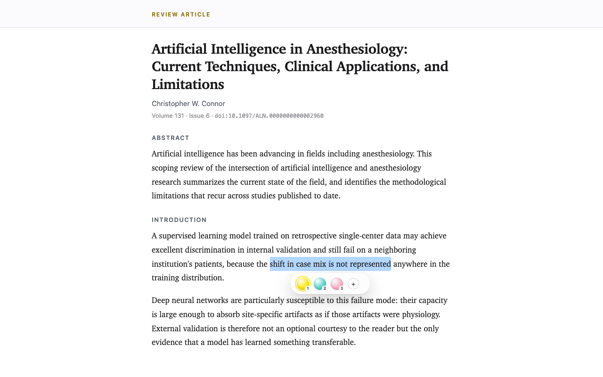
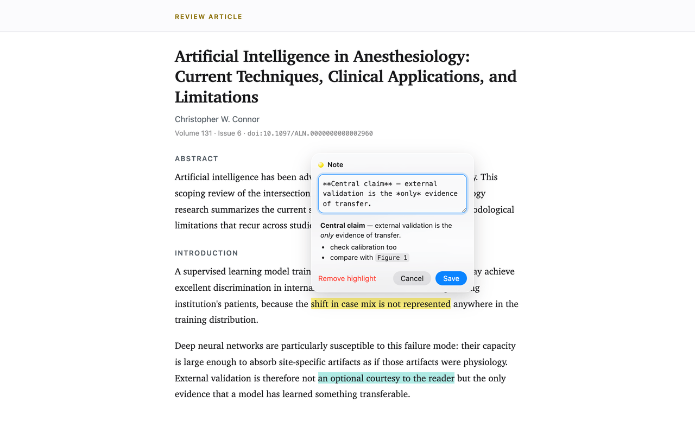
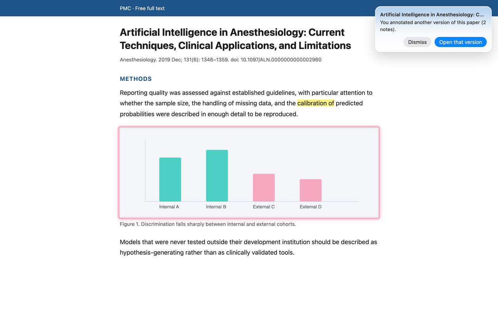
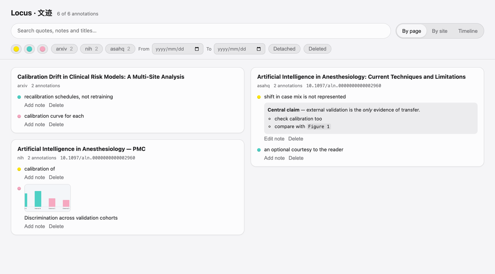

<p align="center">
  
</p>

<p align="center">
  <a href="https://github.com/laleoarrow/locus/releases"></a>
  
  
  
</p>

A minimal, **local-first annotation layer for academic reading**, shipped as a
Manifest V3 extension for Chrome and Microsoft Edge.

| Liquid-glass toolbar | Markdown notes | Image rings |
|---|---|---|
|  |  |  |



Locus is not a reference manager. It does one thing: let you highlight and
annotate the HTML pages you read, keep those annotations on your machine, and
bring them back reliably — even when the page shifts under you.

- **On everywhere, off anywhere.** Works on every page out of the box.
  Don't want it somewhere? ⌘-hover the toolbar's right edge and click ✕, or
  flip the switch in the popup — per-site, instantly reversible.
- **Same paper, different site?** Locus reads the page's DOI (locally) and,
  when you open another version of a paper you annotated — publisher page,
  PMC mirror, preprint — offers a one-click jump back to your annotated
  version. Toggle in the side panel.
- **Select → highlight → note.** Selecting text pops a liquid-glass toolbar
  with three colors (fluorescent yellow, teal, pink). Press **1/2/3** to pick
  a color from the keyboard; the last-used color is remembered. Clicking a
  highlight opens a **Markdown** note editor with live preview — **Enter**
  saves (Shift+Enter for a newline), **Delete** on an empty note (or
  **⌘/Ctrl+Delete** anytime) removes the highlight. **Cmd+Z / Ctrl+Z** undoes
  your last highlight. Select across several existing highlights and press
  **Delete / Backspace** to remove them together; one undo restores the batch.
- **Images too.** Clicking a figure — including one wrapped in a link — offers
  the same toolbar and draws a glowing ring around the image. Cmd/Ctrl-click
  still follows the underlying link.
- **Your palette, your layout.** A page starts with at most five color choices.
  The toolbar's **+** orb can add more for that page only (they get the next
  shortcut digits; manage them under *Colors on this page* in the side panel).
  Other pages stay compact, and removing a choice never recolors annotations
  already made with it. The toolbar shows below the selection by default, or
  set it to *above* / *auto* — auto dodges other extensions' floating toolbars.
- **Sync through storage you own.** Point Locus at a WebDAV folder (坚果云 /
  Nutstore, Nextcloud, anything WebDAV) once, and every device keeps itself
  merged — no account, no server of ours. Or just use **Export / Import** for a
  plain JSON backup you can carry around.
- **Local only.** Everything lives in IndexedDB. No accounts, no telemetry,
  nothing about your pages leaves the machine. Only two features touch the
  network, both switchable off: the WebDAV sync you configure, and an update
  check that reads GitHub release metadata (no data about you is sent). Sync
  credentials are stored locally and never included in an exported backup.
- **Resilient anchors.** Each annotation stores the exact text, surrounding
  context, character positions, and DOM paths; recovery tries them in order.
  An annotation that can't be re-anchored shows as *detached* in the side
  panel — it is never silently deleted.
- **Non-invasive rendering.** CSS Custom Highlight API where available (zero
  DOM mutation, zero layout shift); a zero-box `<mark>` fallback elsewhere.
  All extension UI lives in a Shadow DOM.
- **Native side panel.** Chrome/Edge Side Panel lists the current page's
  annotations; click to scroll-and-pulse; delete is a tombstone with undo.

See [ARCHITECTURE.md](ARCHITECTURE.md) for the design and
[docs/ACCEPTANCE-TEST-PLAN.md](docs/ACCEPTANCE-TEST-PLAN.md) for the test plan.

## Development

```bash
pnpm install       # installs deps + generates WXT types
pnpm dev           # dev mode (Chrome)
pnpm dev:edge      # dev mode (Edge)
```

## Quality gates

```bash
pnpm typecheck     # wxt prepare + tsc --noEmit (strict)
pnpm test          # Vitest unit tests (anchoring, repo, url)
pnpm e2e           # builds --mode e2e and runs Playwright extension tests
pnpm build         # production build → .output/chrome-mv3
pnpm build:edge    # production build → .output/edge-mv3
```

The e2e build pre-grants `http://localhost/*` only so Playwright can bypass
the (un-automatable) native permission prompt; production builds request no
host access at install.

## Download

Grab the latest packaged build from the
[Releases page](https://github.com/laleoarrow/locus/releases) —
`locus-x.y.z-edge.zip` for Microsoft Edge, `locus-x.y.z-chrome.zip` for
Chrome. Unzip it, then load the folder as an unpacked extension (steps
below). To build from source instead:

## Installing in Edge (or Chrome)

1. `pnpm build:edge` (or `pnpm build` for Chrome). `pnpm zip:edge` also
   produces a distributable archive under `.output/`.
2. Edge: open `edge://extensions`, turn on **Developer mode** (left sidebar),
   click **Load unpacked**, and pick the `.output/edge-mv3` folder.
   Chrome: `chrome://extensions` → Developer mode → *Load unpacked* →
   `.output/chrome-mv3`.
3. Open any article, select text (or click a figure), and highlight away.

The manifest pins a public `key`, so the extension ID no longer depends on where
the folder lives — updating by replacing the folder keeps your annotations.

**Coming from v0.3.0 or earlier?** Those builds had a path-derived ID, so the new
build starts with an empty library. To carry your annotations across, run
`node scripts/migrate-bridge.mjs`, reload, export a backup from the side panel,
then `pnpm build:edge`, reload again and import it. (The script prints these
steps.) Skip this if you have nothing worth keeping yet.

## The library — everything you have annotated

Click the extension icon → **All annotations →** to open a full-page view of
every annotation across every site. Three ways to look at the same collection:

| Mode | What you see |
|---|---|
| **By page** | One card per annotated page, listing its highlights and notes |
| **By site** | Pages collapsed under their domain |
| **Timeline** | Everything newest-first, split by day |

Search runs over quoted text, notes and page titles, with the match marked.
Filter by colour, site, date, **detached**, or **deleted** — deleted
annotations were always kept, and now there is a bin to restore them from.
Click any annotation to open its page and scroll straight to it, even if that
tab is not open. Notes can be edited here without leaving the library.

## Sync between devices

Side panel → **Sync (WebDAV)** → *Setup*:

| Field | 坚果云 / Nutstore example |
|---|---|
| Address | `https://dav.jianguoyun.com/dav/locus/` |
| Account | your account email |
| App password | 坚果云 → 账户信息 → 安全选项 → 添加应用密码 |

Hit *Test*, flip the switch on, and Locus keeps that folder and this browser
merged — pushing a few seconds after you annotate and pulling on a timer. Point
a second device at the same folder and both converge. Any WebDAV host works
(Nextcloud, ownCloud, a self-hosted server); use an **app password**, not your
account password.

Prefer files? **Backup → Export** writes the whole library to JSON, and
**Import** merges one back in — the same merge as sync, so it is safe to import
the same file twice.

## Publishing to the stores

Store-installed extensions auto-update; sideloaded ones never do. See
[docs/STORE-SUBMISSION.md](docs/STORE-SUBMISSION.md) for the prepared listing
copy, permission justifications, assets, and step-by-step submission for both
Edge Add-ons and the Chrome Web Store. Privacy policy:
[docs/PRIVACY.md](docs/PRIVACY.md).
