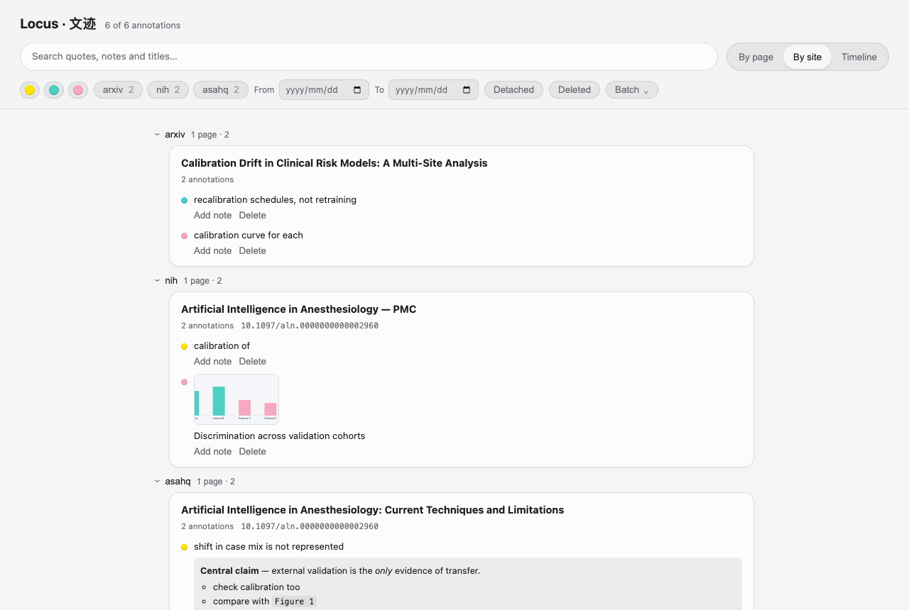
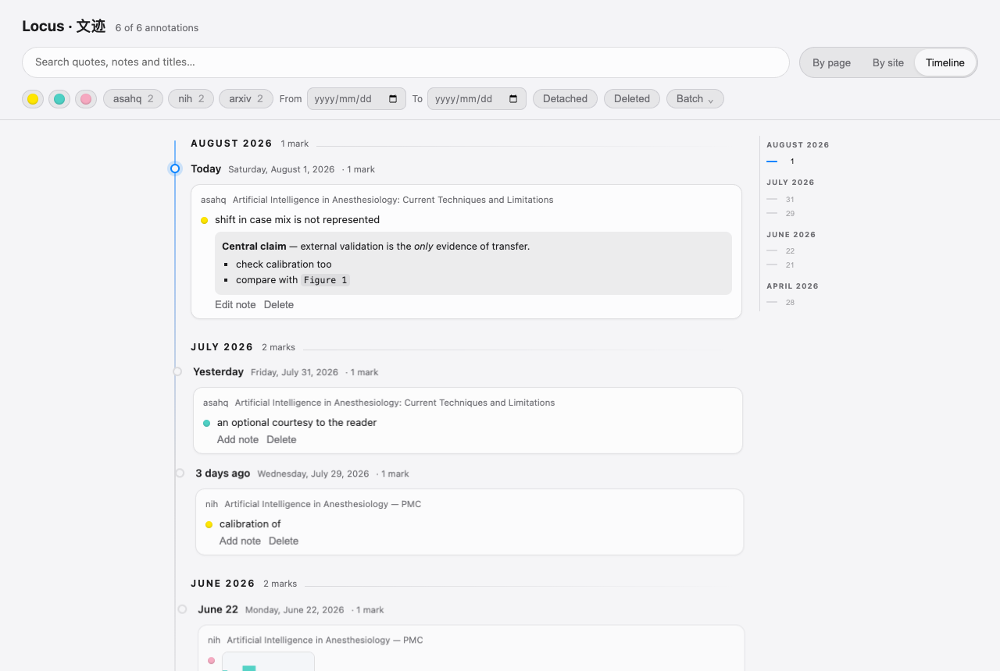
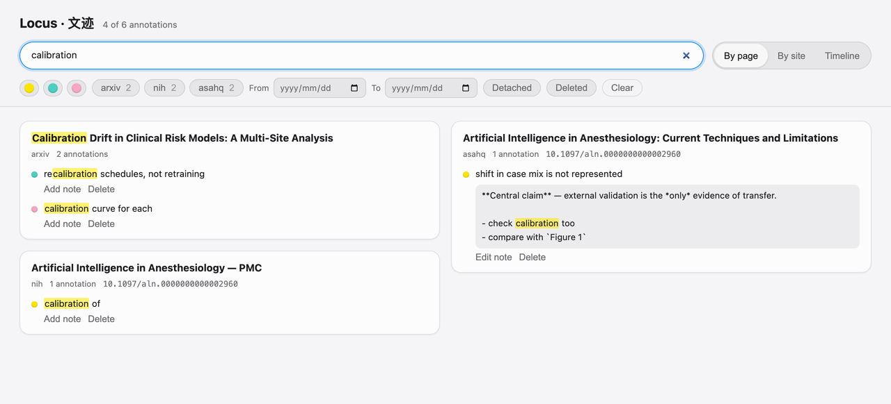
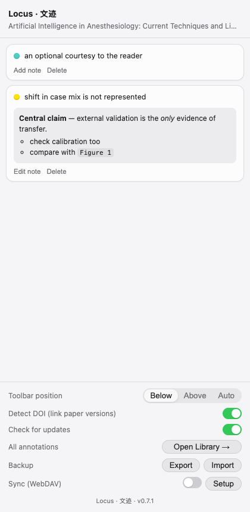

<p align="center">
  
</p>

<p align="center">
  <a href="https://github.com/laleoarrow/locus/releases"></a>
  
  
  
</p>

A minimal, **local-first annotation layer for academic reading**, shipped as a
Manifest V3 extension for Chrome and Microsoft Edge.

### While you read

| Liquid-glass toolbar | Markdown notes | Image rings |
|---|---|---|
|  |  |  |
| Select any text and a compact toolbar appears. Click a colour, or press **1 / 2 / 3** without leaving the keyboard. | Click a highlight to write a note in **Markdown**, with a live preview underneath. **Enter** saves. | Select a figure by dragging across it or from just before it to just after it, then choose a colour to ring it. Ordinary clicks still open links and image viewers. |

### Afterwards — everything in one place

Reading happens across dozens of tabs and comes back to you weeks later. The
**library** is a full page listing every annotation you have made, on every
site: grouped, searchable, and one click away from the passage it came from.


<details>
<summary><b>More screenshots</b> — grouping, search, and the side panel</summary>

<br>

**Group by site.** The same collection folded by domain, so you can walk back
through "what did I read on PMC" rather than hunting for a title you half
remember.



**Timeline.** Travel back through your reading history on a day rail. Month
eras, relative dates and receding card surfaces show when a note belongs,
without fading the words themselves.



**Search across the whole library.** Matches quoted text, your notes and page
titles at once, and marks the hit so you can see *why* a result came back. A
note that matches is shown as plain text rather than rendered Markdown,
precisely so the match stays visible.



**Side panel, for the page in front of you.** Chrome and Edge's native side
panel lists this page's annotations; click one to scroll to it and watch it
pulse. Backup, sync and per-page colours live at the bottom.



</details>

Locus is not a reference manager. It does one thing: let you highlight and
annotate the HTML pages you read, keep those annotations on your machine, and
bring them back reliably — even when the page shifts under you.

- **On everywhere, off anywhere.** Works on every page out of the box.
  Don't want it somewhere? ⌘-hover the toolbar's right edge and click ✕, or
  flip the switch in the popup — per-site, instantly reversible.
- **Same paper, different site?** Locus reads the page's DOI (locally) and,
  when you open another version of a paper you annotated — publisher page,
  PMC mirror, preprint — offers a one-click jump back to your annotated
  version. Toggle in the side panel.
- **Select → highlight → note.** Selecting text pops a liquid-glass toolbar
  with three colors (fluorescent yellow, teal, pink). Press **1/2/3** to pick
  a color from the keyboard; the last-used color is remembered. Clicking a
  highlight opens a **Markdown** note editor with live preview — **Enter**
  saves (Shift+Enter for a newline), **Delete** on an empty note (or
  **⌘/Ctrl+Delete** anytime) removes the highlight. **Cmd+Z / Ctrl+Z** undoes
  your last highlight. Select across several existing highlights and press
  **Delete / Backspace** to remove them together; one undo restores the batch.
- **Images too, without stealing clicks.** Drag across a figure, or from just
  before it to just after it, to select it for the same toolbar and draw a
  glowing ring. An ordinary click always stays
  with the page, so linked figures, zoom viewers and publisher controls keep
  working even after an image has been annotated.
- **Your palette, your layout.** A page starts with at most five color choices.
  The toolbar's **+** orb can add more for that page only (they get the next
  shortcut digits; manage them under *Colors on this page* in the side panel).
  Other pages stay compact, and removing a choice never recolors annotations
  already made with it. The toolbar shows below the selection by default, or
  set it to *above* / *auto* — auto dodges other extensions' floating toolbars.
- **One library for everything.** A full page listing every annotation across
  every site — grouped by page, by site, or as a timeline; searchable over
  quotes, notes and titles; filterable by colour, site, date, detached or
  deleted. Replace one annotation colour across the whole live library from a
  compact batch menu. Deleted annotations land in a bin you can restore from,
  and any result is one click from the passage it came from.
- **Sync through storage you own.** Point Locus at a WebDAV folder (坚果云 /
  Nutstore, Nextcloud, anything WebDAV) once, and every device keeps itself
  merged — no account, no server of ours. Or just use **Export / Import** for a
  plain JSON backup you can carry around.
- **Local only.** Everything lives in IndexedDB. No accounts, no telemetry,
  nothing about your pages leaves the machine. Only two features touch the
  network, both switchable off: the WebDAV sync you configure, and an update
  check that reads GitHub release metadata (no data about you is sent). Sync
  credentials are stored locally and never included in an exported backup.
- **Resilient anchors.** Each annotation stores the exact text, surrounding
  context, character positions, and DOM paths; recovery tries them in order.
  An annotation that can't be re-anchored shows as *detached* in the side
  panel — it is never silently deleted.
- **Non-invasive rendering.** CSS Custom Highlight API where available (zero
  DOM mutation, zero layout shift); a zero-box `<mark>` fallback elsewhere.
  All in-page extension UI lives in a Shadow DOM.
- **Native side panel.** Chrome/Edge Side Panel lists the current page's
  annotations; click to scroll-and-pulse; delete is a tombstone with undo.

See [ARCHITECTURE.md](ARCHITECTURE.md) for the design and
[docs/ACCEPTANCE-TEST-PLAN.md](docs/ACCEPTANCE-TEST-PLAN.md) for the test plan.

## Development

```bash
pnpm install       # installs deps + generates WXT types
pnpm dev           # dev mode (Chrome)
pnpm dev:edge      # dev mode (Edge)
```

## Quality gates

```bash
pnpm typecheck     # wxt prepare + tsc --noEmit (strict)
pnpm test          # Vitest unit tests (anchoring, repo, url)
pnpm e2e           # builds --mode e2e and runs Playwright extension tests
pnpm build         # production build → .output/chrome-mv3
pnpm build:edge    # production build → .output/edge-mv3
```

The e2e build uses the same `http://*/*` / `https://*/*` host permission as
production and runs only against localhost fixtures. Broad page access is core
to an annotation tool because the articles a user may read cannot be listed in
advance; Locus can be disabled per site at any time.

## Download

Grab the latest packaged build from the
[Releases page](https://github.com/laleoarrow/locus/releases) —
`locus-x.y.z-edge.zip` for Microsoft Edge, `locus-x.y.z-chrome.zip` for
Chrome. Unzip it, then load the folder as an unpacked extension (steps
below). To build from source instead:

## Installing in Edge (or Chrome)

1. `pnpm build:edge` (or `pnpm build` for Chrome). `pnpm zip:edge` also
   produces a distributable archive under `.output/`.
2. Edge: open `edge://extensions`, turn on **Developer mode** (left sidebar),
   click **Load unpacked**, and pick the `.output/edge-mv3` folder.
   Chrome: `chrome://extensions` → Developer mode → *Load unpacked* →
   `.output/chrome-mv3`.
3. Open any article, select text (or select a figure by dragging across it), and highlight away.

The manifest pins a public `key`, so the extension ID no longer depends on where
the folder lives — updating by replacing the folder keeps your annotations.

**Coming from v0.3.0 or earlier?** Those builds had a path-derived ID, so the new
build starts with an empty library. To carry your annotations across, run
`node scripts/migrate-bridge.mjs`, reload, export a backup from the side panel,
then `pnpm build:edge`, reload again and import it. (The script prints these
steps.) Skip this if you have nothing worth keeping yet.

## The library

Open it from the extension icon → **All annotations →**, or from the side
panel. The three groupings are shown in the screenshots above; this is what
else it does.

**Filters** — colour, site, date range, **detached**, and **deleted**. The
deleted filter is a bin: nothing is ever hard-deleted, so anything you removed
is still there to restore.

**Jump back** — clicking an annotation opens its page and scrolls to it, even
if that tab is not open. Notes are editable without leaving the library.

**Sites are grouped by family**, not by exact host, so `www.nature.com` and
`nature.com` fold together as `nature`, and GitHub Pages sits with
`github.com`. This keeps the site filter short on collections that span many
subdomains.

**Long pages stay readable** — a card shows five annotations, with an ellipsis
to expand the rest, and the masonry layout packs shorter cards instead of
leaving empty grid rows.

**Timeline is a journey, not a flat list** — a navigable day rail groups the
history into month eras. Relative labels make recent days easy to recognise;
older cards recede through their surfaces while quote text stays fully opaque.

**Batch colour changes** — beside **Clear**, open **Batch → Replace annotation
colours…** to convert one existing colour across the whole live library in one
atomic operation. The dialog shows the exact affected count; detached
annotations are included and deleted annotations are left untouched. There is
no bulk undo, so review the count first (or Export a backup).

## Sync between devices

Side panel → **Sync (WebDAV)** → *Setup*:

| Field | 坚果云 / Nutstore example |
|---|---|
| Address | `https://dav.jianguoyun.com/dav/locus/` |
| Account | your account email |
| App password | 坚果云 → 账户信息 → 安全选项 → 添加应用密码 |

Hit *Test*, flip the switch on, and Locus keeps that folder and this browser
merged — pushing a few seconds after you annotate and pulling on a timer. Point
a second device at the same folder and both converge. Any WebDAV host works
(Nextcloud, ownCloud, a self-hosted server); use an **app password**, not your
account password.

Prefer files? **Backup → Export** writes the whole library to JSON, and
**Import** merges one back in — the same merge as sync, so it is safe to import
the same file twice.

## Publishing to the stores

Store-installed extensions auto-update; sideloaded ones never do. See
[docs/STORE-SUBMISSION.md](docs/STORE-SUBMISSION.md) for the prepared listing
copy, permission justifications, assets, and step-by-step submission for both
Edge Add-ons and the Chrome Web Store. Privacy policy:
[docs/PRIVACY.md](docs/PRIVACY.md).
